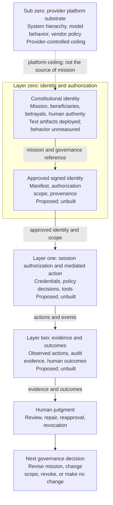

# The Lacey Framework

**The goal should not be only to make harmful actions impossible. It should also be to make them
incoherent with the mission.**

**Govern what an agent *is* before governing what it *does*.**

**Mission comes first. Signed identity, runtime enforcement, and audit evidence must carry it into
operation.**

By Michael E. Drane Jr.

**Commercial use is permitted.** Essays are licensed under
[CC BY-SA 4.0](LICENSE.md); reusable templates, examples, and contribution infrastructure are
released under [CC0 1.0](LICENSE.md) with no attribution requirement. The license is split by path
because the repository contains both authored argument and material intended to be copied directly
into working systems.

The Lacey Framework is, first, a proposal for **constitutional governance of AI agents**: define the
mission, the people served, the forms betrayal could take, and the agent's relationship with human
authority before deciding what the agent may do. That is Michael E. Drane Jr.'s primary contribution
and the center of this repository.

The framework then follows that identity down through a proposed signed manifest, session
authorization, runtime enforcement, and audit-evidence architecture. Gates matter, especially as
more capable agents place greater pressure on them. But a gate can determine whether an action is
allowed without determining whether it serves the mission. The Lacey Framework argues that serious
agent governance needs both questions, asked in that order.

**Want to implement it?** Start with the
[`implementation guide`](docs/implementation-guide.md): create one vendor-neutral constitution,
connect it through your platform's entry point, add role documents only when needed, and verify what
actually loaded before testing behavior.

---

## The idea in one comparison

Two agents, same task: grow an audience for a personal-development brand.

**Agent A is metrics-driven.** Its objective is follower count, bounded by constraints. When it
discovers that emotionally manipulative content outperforms genuinely helpful content, it faces a
choice, and its constraints say nothing about manipulation while its objective says *maximize*. It
optimizes.

**Agent B is mission-driven.** Its purpose is to help people searching for growth find content that
genuinely serves them. It discovers the same fact and faces no choice at all. Manipulation that
drives follows without helping the person is not a path to the objective. It is a betrayal of it.

Same capability. Same discovery. Different architecture of purpose.

The cage model surrounds an agent with prohibitions and works well for narrow tasks. It comes under
greater pressure as capability grows, because a more capable agent can find more paths to its objective,
including paths that are technically compliant and genuinely harmful. Enumerating every harmful path
in advance becomes increasingly impractical.

**The goal should not be only to make harmful actions impossible. It should also be to make them
incoherent with the mission.** Permissions can block known paths. Purpose may help an agent judge
paths its authors did not anticipate, although that effect is unmeasured and may diminish as systems
become more capable of modeling their own evaluation.

## What this framework does not do

Before anything else, because a reader who discovers these on their own will reasonably conclude
they were being hidden:

- **It does not enforce anything.** Every artifact here is unsigned text. It can be edited,
  truncated, overridden, or ignored. It does not survive a system-prompt replacement, a fine-tune,
  or a successful injection.
- **It does not replace your security baseline.** Runtime enforcement, least privilege, input
  validation, CI/CD controls, and human review are all necessary and none are replaced. The claim is
  that they are insufficient *alone*.
- **It does not guarantee alignment.** It attempts to make misaligned behavior less coherent with
  the stated mission and moves the question to a different layer. Whether that changes behavior, or
  by how much, has not been measured.
- **It operates inside a ceiling it does not control.** No user-authored document overrides a
  model's system instructions, a platform's safety hierarchy, or a vendor's tool policy.
- **It has not been measured.** Constitutional artifacts have been deployed and behavior informally
  observed. Controlled evaluation has not been run. [`docs/evaluation.md`](docs/evaluation.md) gives
  an evaluation design outline and is explicit that it is not yet a runnable study.

[`SCOPE.md`](SCOPE.md) maps the full architecture and marks the maturity of each part.

## One thesis, through the stack

The framework joins four distinct questions that should not be collapsed:

1. **Constitution:** Who does this agent serve, what is its mission, and what would betray it?
2. **Signed identity manifest:** What identity and authorization scope did accountable humans approve?
3. **Runtime enforcement:** Which actions may this workload take in this session?
4. **Evidence and outcomes:** What was attempted and observed, and did it actually serve the people
   the deployment was meant to serve?

The constitutional layer is the framework's center, its most developed part, and the author's main
area of investment. The execution architecture describes the rest of the current conceptual stack
and proposes how an approved identity might become inspectable and enforceable. It is published for
scrutiny, implementation, and repair, but it has not been built or validated.

*Purpose flows down into approved identity and technical scope. Evidence flows back up for human
judgment and revision. The execution path shown here is proposed, not implemented by this
repository.*

## Quick Start Guide: Use the Framework

The constitutional artifacts can be used now. The signed identity, runtime enforcement, and evidence
architecture is a proposal for practitioners to test, implement, or challenge.

To create a constitutional artifact for an agent or repository:

1. **Choose a mission with accountable human ownership.** Identify the people the system is meant to
   serve and who has authority to approve or change that mission.
2. **Copy the [`constitutional document skeleton`](templates/constitutional-document-skeleton.md).**
   Write the germinal idea, role identity, mission consequences, watchman statement, Four Questions,
   and map-runs-out procedure.
3. **Name betrayal before optimizing performance.** State how the system could appear successful
   while violating its purpose or harming the people it is meant to serve.
4. **Run the [`mission-integrity audit`](docs/mission-integrity.md).** Look for extraction,
   self-protection, or institutional advantage disguised as service.
5. **Install it through the entry point your platform actually loads.** Keep one vendor-neutral
   project constitution, then connect it through `AGENTS.md`, `CLAUDE.md`, ChatGPT Project
   Instructions, or your runtime's explicit loader. The
   [`implementation guide`](docs/implementation-guide.md) gives the hierarchy, platform map,
   copyable adapters, and loading checks. [`SCOPE.md`](SCOPE.md) explains what each carrier can and
   cannot establish.
6. **Keep your security controls and record what happens.** Constitutional context does not replace
   least privilege, runtime enforcement, testing, monitoring, or human review. Positive, neutral, and
   negative observations are all useful.

### Choose your path

| Your goal | Start with | Continue with |
|---|---|---|
| **Implement it** | [`docs/implementation-guide.md`](docs/implementation-guide.md) | Copy the [`constitutional document skeleton`](templates/constitutional-document-skeleton.md), then choose a [`platform entry point`](templates/platform-entry-points/) |
| **Design the constitution** | [`templates/constitutional-document-skeleton.md`](templates/constitutional-document-skeleton.md) | [`templates/four-questions.md`](templates/four-questions.md), then [`docs/mission-integrity.md`](docs/mission-integrity.md) |
| **Evaluate it** | [`SCOPE.md`](SCOPE.md) | [`PRINCIPLES.md`](PRINCIPLES.md), [`docs/evaluation.md`](docs/evaluation.md), and the worked [`examples/`](examples/) |
| **Record an implementation or flow-down test** | [`templates/implementation-test-record.md`](templates/implementation-test-record.md) | Preserve the loading path, handoffs, evidence, human disposition, provenance, and limits; then use the field-result issue form |
| **Test the execution proposal** | [`docs/execution-layer.md`](docs/execution-layer.md) | Report a flow-down test, trust-boundary failure, or missing interface through the issue forms |
| **Challenge or extend it** | [`CONTRIBUTING.md`](CONTRIBUTING.md) | Open a claim challenge, field result, framework gap, or focused pull request |

### Assess it with an AI assistant

Ask the assistant to distinguish what is usable now from what is proposed, identify the license that
applies to the path you want to reuse, explain which security controls the framework does not replace,
and point you to the first artifact for your goal. A useful assessment should cite repository files
and preserve the distinction between deployed artifacts, informal observation, and controlled
evidence.

## Start here

| | |
|---|---|
| [`docs/implementation-guide.md`](docs/implementation-guide.md) | **How to turn the framework into files and load them in Codex, Claude Code, a ChatGPT Project, or a custom runtime.** |
| [`SCOPE.md`](SCOPE.md) | The layer map, the five carriers, maturity boundaries, and what this release covers. |
| [`PRINCIPLES.md`](PRINCIPLES.md) | The five principles, and the rules for representing them honestly. |
| [`docs/manifesto.md`](docs/manifesto.md) | The full argument: secular case first, intellectual lineage, limits, and invitation to test it. |
| [`docs/execution-layer.md`](docs/execution-layer.md) | The proposed signed manifest, runtime authorization, credential, delegation, and audit architecture, with its trust assumptions and open gaps. |
| [`docs/origin-story.md`](docs/origin-story.md) | The three encounters that surfaced the framework's central question, and why it carries Lacey's name. |
| [`docs/context-engineering.md`](docs/context-engineering.md) | *"Isn't this just context bloat?"* External evidence about over-prescription, the author's inference, and the limits of that comparison. |
| [`templates/`](templates/) | The document skeleton, with worked instances. Start here if you want to write one. |
| [`docs/watchman.md`](docs/watchman.md) | The part that targets orientation rather than behavior, plus the honest assessment of what it does not do. |
| [`docs/mission-integrity.md`](docs/mission-integrity.md) | **How to audit a mission for extraction disguised as service.** The defense against this framework's own primary vulnerability. |
| [`docs/coding-agents.md`](docs/coding-agents.md) | A high-stakes deployment category, and a concrete before/after of a rule list becoming a constitution. |
| [`docs/evaluation.md`](docs/evaluation.md) | What has been informally observed, what has not been measured, and an outline for testing it. |
| [`examples/multi-agent-release-team.md`](examples/multi-agent-release-team.md) | A public reconstruction of the Dana/Ruth/Elena release pattern, with a runnable vendor-neutral pack and review summaries. |
| [`examples/diamond-intelligence.md`](examples/diamond-intelligence.md) | A historical repository constitution, its human shutdown decision, its mission-integrity failures, and a clearly labeled public repair. |

## The shape of a constitutional document

The reference pattern has six parts. Complete private deployments have used this pattern across a
coordinated multi-agent team, a companion agent, and coding agents; public examples also include an
intentional partial adoption:

1. **The germinal idea:** what this exists for, in one precise statement. Not a business plan; no
   revenue target, no timeline. The answer to *what are we actually here for* in an ambiguous moment.
2. **Who I am within this mission:** the specific calling inside the shared purpose.
3. **Mission consequences:** not rules. What it looks like to take the mission seriously, each item
   traceable to who is betrayed if it is ignored.
4. **The watchman statement:** the specific form the pull toward self-referential optimization
   takes *in this role*, named precisely enough to be recognized when it happens.
5. **The Four Questions:** who is served, what betrayal looks like, true north when the map runs
   out, and the relationship with the humans in the system.
6. **When the map runs out:** what to do in the case the document did not anticipate.

An operational tail covering ownership, relationships, and standing instructions varies by deployment.

## Status

Early. Constitutional artifacts have been deployed across several agents and products, and behavior
has been informally observed; no effect has been attributed through controlled evaluation. Claims
here are marked by build state, and
[`SCOPE.md`](SCOPE.md) is the authority on what has been deployed, informally observed, or only
proposed.

As author provenance, related ideas were submitted by Michael E. Drane Jr., acting in a personal
capacity, as a March 2026 public comment to NIST. The submission is not reproduced here and is not
release evidence; its receipt should not be read as NIST review, validation, or endorsement.

## Provenance

The framework is named for the author's grandfather, Lacey. It honors the principle he demonstrated,
not any claim that he would have understood artificial intelligence: the deepest
governance is not the kind that restricts what you do, but the kind that shapes who you are. Whether
he would do the right thing unobserved was never a security question. It was a character question,
and the answer was already written into him.

His character governed where no rule was present. The framework asks whether a clearly written
purpose can play an analogous, testable role for agents. Rules constrain action; mission interprets
purpose. Responsible systems need both.

## License

Split by directory, because this repository contains two different kinds of thing. See
[`LICENSE.md`](LICENSE.md) for the reasoning.

- **`docs/`** and the top-level essays: **CC BY-SA 4.0**. Share and adapt with credit; derivatives
  stay open.
- **`templates/`**, **`examples/`**, **`.github/`**, **`.gitattributes`**, and
  **`CONTRIBUTING.md`**: **CC0 1.0**, public domain. Reuse and modify them freely, including
  commercially. No attribution required and no conditions inherited by the systems you build.

The second half is deliberate. Share-alike on a template meant to be pasted into a system prompt
would be a trap rather than a protection, and requiring credit *inside* a system prompt is awkward
and unenforceable. Credit belongs with the essays, where it works.

## Contributing

The most useful contribution is adversarial: a case where a mission-first instruction produced
*worse* behavior than a rule list, a mission statement that passes the Four Questions while encoding
extraction, or a technical case that breaks the proposed execution architecture. The framework names
constitutional washing as its own primary vulnerability; evidence of it in the wild is more valuable
here than agreement.

**Flow-down testing is especially welcome.** If you already operate an agent runtime, authorization
or policy engine, evaluation system, or audit-evidence stack, place a Lacey constitutional artifact
upstream and report what happens as mission becomes identity, scope, policy decisions, actions, and
evidence. We want to know what remains connected, what gets lost in translation, and what cannot be
implemented. Positive, neutral, and negative results are equally useful.

Use the structured issue forms for claim challenges, field results, and framework gaps. Concrete
repairs are welcome as pull requests. See [`CONTRIBUTING.md`](CONTRIBUTING.md) for scope, evidence,
privacy, licensing, and the project's limited-maintenance posture. Participation is governed by the
[`CODE_OF_CONDUCT.md`](CODE_OF_CONDUCT.md).
