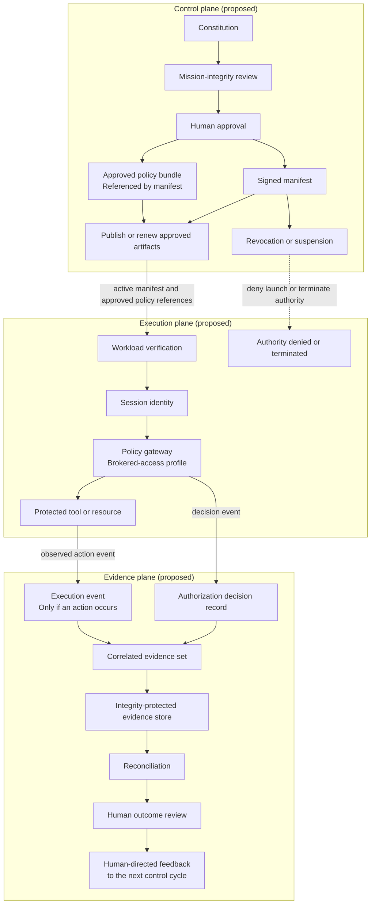

# The proposed execution layer

**Status: proposed architecture. Not implemented, standardized, validated, or production-ready.**

This document begins below the Lacey Framework's center.

**Mission-Aligned Governance is the framework's primary contribution.** It defines who the agent
serves, what would betray that purpose, how it should reason when instructions are incomplete, and
how it relates to human authority. The execution architecture asks what infrastructure would be
needed to carry that approved identity into a running workload, enforce technical boundaries, and
return evidence about what occurred.

Publishing the technical proposal keeps the constitutional thesis grounded in the broader agent
governance problem. Mission without enforcement remains editable text. Enforcement without mission
can authorize an action that serves the wrong purpose. The layers are complementary, but they are
not interchangeable and they are not equally mature.

**The goal should not be only to make harmful actions impossible. It should also be to make them
incoherent with the mission.** The execution layer addresses technical possibility. Mission-Aligned
Governance addresses coherence with purpose. Neither is sufficient alone, and the framework begins
with the latter.

This document updates ideas submitted in a personal-capacity March 2026 public comment to NIST. It
is not the filed comment, a NIST position, or evidence of endorsement. It is the current public
version of the proposed architecture.

## What the system must distinguish

| Artifact or layer | Question it answers | What it cannot establish alone |
|---|---|---|
| Constitutional document | Who is served, what is the mission, and how should ambiguity be handled? | That the text is authentic, current, loaded, followed, or enforced. |
| Signed Agent Identity Manifest | What identity and scope did an authorized human approve? | That the mission is benign or that the agent behaved accordingly. |
| Workload and session identity | Which running process is requesting this action? | Whether the requested action serves the mission. |
| Runtime policy enforcement | Is this action within the approved technical boundary? | Whether an allowed action is wise, truthful, or mission-coherent. |
| Audit evidence | What action was attempted, allowed, denied, and observed? | Complete ground truth if instrumentation is missing, bypassed, or compromised. |
| Human review and outcomes | Did the deployment serve the people it was intended to serve? | Automatic proof of causation or agent intent. |

The architecture is useful only if these distinctions remain visible. A signature proves integrity
and provenance relative to a trusted key. It does not prove safety. A permit decision proves that a
policy allowed an action. It does not prove that the action served the mission.

## Three planes and their trust boundaries

The proposal can be read as three interacting planes:

- **Control plane:** constitution and manifest authoring, review, canonicalization, approval,
  signing, policy compilation, publication, renewal, and revocation.
- **Execution plane:** workload identity, session authorization, policy decision and enforcement
  points, credential brokering, human approval, agents, and tools.
- **Evidence plane:** structured event collection, integrity protection, retention, correlation,
  access control, and post-run verification.

The design depends on assumptions that an implementation would have to state and test: trusted
signing keys, correct workload binding, complete mediation of protected tools, isolation of
downstream credentials, reliable clocks, protected policy distribution, and controlled access to
the evidence store. If one of those assumptions fails, a valid signature or log record may create
confidence without creating the claimed protection.

A signature authenticates approved bytes and their issuer. It does not prove that the contents are
correct, that a runtime loaded them, or that a model followed them.

*Proposed control, execution, and evidence planes. Every connection depends on stated trust
assumptions; a signature or log does not prove that an action served the mission. Brokered access is
one proposed profile. Just-in-time credentials remain an alternative described below. Human outcome
review informs the next control cycle; it does not revise policy automatically.*

## The AI Agent Identity Manifest

The proposed Agent Identity Manifest is a signed, versioned governance artifact. Its closest analogy
is an SBOM: not because an agent is software inventory, but because both artifacts make an approved
state inspectable, portable, and verifiable.

The schema below is a minimum proposal, not a finalized standard.

### 1. Manifest metadata

- Manifest schema name and version
- Globally unique agent identifier
- Human-readable role and deployment name
- Owning organization and accountable human owner
- Issuing authority and approving authorities
- Issue time, activation time, expiration time, and superseded version
- Previous-manifest digest or another explicit continuity link
- Deployment environment and scope
- Model, runtime, and configuration identifiers where the platform exposes them

Model identifiers are provenance fields, not complete reproducibility guarantees. Providers may
change hosted behavior without exposing a stable weight or system-prompt hash.

### 2. Mission and governance reference

- Mission statement
- People or groups ultimately served
- Named betrayals, conflicts of interest, and refusal conditions
- Procedure for ambiguity and conflicting instructions
- Human authority, escalation, and override boundaries
- Constitutional document URI or artifact reference
- Cryptographic digest of the approved constitutional document
- Mission-integrity review record and reviewer identity

The manifest should reference the approved constitution rather than duplicate it across multiple
fields. A digest detects modification; it does not establish that the runtime actually loaded or
followed the document.

### 3. Authorization scope

- Approved tools and endpoints
- Permitted action classes and parameters
- Data classifications and resources the agent may read, write, or disclose
- Network and execution boundaries
- Financial, time, and rate limits, plus cumulative-risk limits where an experimental method is
  explicitly defined
- Human-in-the-loop thresholds
- Delegation authority and maximum delegation depth
- Prohibited actions that require mechanical denial
- Conditions requiring refusal, escalation, or session termination

Mission consequences belong in the constitution. Mechanically enforceable boundaries belong here.
Some requirements may appear in both, but one source should be authoritative for each enforcement
decision.

### 4. Runtime binding

- Workload identity and trust domain
- Approved runtime and policy-enforcement endpoint
- Policy bundle identifier and digest
- Credential mode and token audience
- Approved tool gateways or resource servers
- Parent agent or delegating principal, when applicable
- Session-credential derivation rules
- Task or run binding, maximum lifetime, and intended token audience

These fields are intended to bind the approved manifest to a particular running workload and policy
set. Designing a secure binding across hosted models, local runtimes, subprocesses, and delegated
agents remains open work.

### 5. Provenance and lifecycle

- Signing algorithm, key identifier, and signature
- Human approval events and timestamps
- Version history and change reason
- Revocation registry or status endpoint
- Key rotation and recovery policy
- Emergency suspension authority
- Required reapproval triggers

A material change to mission, model, tools, data scope, delegation, or policy should create a new
manifest version and approval event. What counts as material needs a standard definition.

Behavioral signatures, mission-coherence criteria, and drift indicators should remain optional,
experimental extensions until their semantics and evaluation methods are validated.

### 6. Evidence requirements

- Audit event schema and destination
- Required event fields and trace identifiers
- Policy-clause and manifest-version references
- Signing or attestation requirements for events
- Retention, privacy, access, and deletion rules
- Coverage and completeness expectations
- Post-session evidence return and verification status

Logging everything is neither sufficient nor always lawful. Evidence design must minimize sensitive
content while preserving enough context to evaluate authorization and mission coherence.

## Fixed identity and session identity

The architecture separates two identity layers.

### Fixed identity

The signed manifest is the stable, version-controlled statement of what the agent is authorized to
be. It carries mission, ownership, scope, provenance, and lifecycle. It should be verified before a
session begins and reissued after a material change.

### Session identity

Session identity is short-lived and task-scoped. It should be derived from a valid fixed identity,
bound to a workload and token audience, and attenuated to the permissions needed for the current
task. It expires without changing the fixed identity.

The session may be narrower than the manifest. A conforming implementation must not make it broader.

## Two credential models

### Just-in-time provisioning

The agent receives short-lived credentials for approved resource servers within manifest bounds.
This is compatible with familiar OAuth-style infrastructure and can reduce standing privilege.

The remaining risk is direct possession. During the credential window, a compromised or manipulated
agent may attempt any action the credential permits, including paths that bypass an intended policy
gateway if the resource server accepts the token directly.

### Credential starvation

The agent receives credentials only for a runtime enforcement gateway. It never receives credentials
accepted directly by the underlying tool or resource server. The gateway obtains or presents the
downstream authority after evaluating the request against the session scope and policy.

Within that modeled path, credential starvation removes the agent's direct credential route around
the gateway. It does not make bypass impossible in the broader system. Misconfiguration, alternate
network paths, compromised gateways, ambient credentials, tool vulnerabilities, and uninstrumented
channels can still defeat the design.

Credential starvation is the stronger proposal for high-stakes deployments, but it has not been
implemented or compared here. Its latency, availability, interoperability, and operational costs
need evaluation.

## The authorization lifecycle

1. **Author:** write the constitution and proposed authorization scope.
2. **Review:** perform mission-integrity, security, privacy, and operational review with appropriate
   separation from the author.
3. **Approve:** record the accountable human decisions.
4. **Sign:** issue the fixed manifest through an authorized signing service.
5. **Register:** store the manifest and status in a versioned artifact system.
6. **Verify:** validate signature, status, version, runtime binding, and policy digest before launch.
7. **Derive:** issue a task-scoped session identity no broader than the fixed manifest.
8. **Enforce:** mediate tool actions through the approved policy path.
9. **Record:** emit structured decisions and action evidence tied to the manifest and session.
10. **Reconcile:** compare authorized scope, attempted actions, observed outcomes, and human review.
11. **Expire or revoke:** terminate session authority and update manifest status when required.

Signing authority is a governance role, not merely a key. A complete implementation needs rules for
who may approve which scope, separation of duties, emergency revocation, key compromise, and appeals
or exceptions.

## Before, during, and after

### Before: system of record

Store the approved manifest in a versioned artifact repository. Before execution, verify its
signature, lifecycle status, constitutional digest, runtime binding, and policy-bundle digest.

The result is an inspectable record of what was authorized. Calling the store immutable would be too
strong without a defined tamper-evidence and administrative trust model.

### During: enforcement and structured decisions

A policy enforcement point evaluates each mediated action. An event should record at least:

- Manifest and session identifiers
- Workload and delegating principal
- Tool, resource, action, and relevant parameter classes
- Policy version and authorization clause
- Permit, deny, escalate, or error result
- Human approval reference when required
- Timestamp and trace identifier, plus cumulative-risk state if an experimental method is implemented
- Structured purpose or rationale code, where useful and privacy appropriate

Policy engines such as OPA/Rego, Cedar, NGAC, or equivalent systems may implement parts of this
layer. Naming an engine does not define the policy semantics or prove complete mediation.
The evidence design should not require hidden chain-of-thought, and an agent-generated explanation
should not be treated as authoritative evidence of intent.

### After: audit evidence and reconciliation

Return signed or otherwise attested audit events to a tamper-evident system of record. OpenTelemetry
or another tracing format may carry the events, but transport format is not non-repudiation by
itself.

An auditor should be able to ask:

- Which manifest and human approval authorized this session?
- Which policy version evaluated each action?
- Which actions were attempted, permitted, denied, or escalated?
- Were required tools or paths outside instrumentation coverage?
- Did observed outcomes remain within authorization scope?
- Did allowed behavior remain coherent with the mission, and who judged that?

The final question cannot be answered by authorization logs alone. It requires mission criteria,
outcome evidence, and human judgment.

## Delegation and multi-agent systems

A child agent should receive an attenuated identity derived from its parent or delegating human. The
delegation record should bind:

- Parent, child, and accountable human identities
- Delegated task and mission reference
- Reduced authorization scope
- Maximum depth and redelegation rights
- Time and resource limits
- Evidence-return requirements
- Revocation behavior when the parent or fixed identity changes

No child should inherit ambient authority merely because it was created by an authorized parent.
Multi-agent systems also need a way to reconcile shared mission with role-specific permissions and
to prevent privilege accumulation across cooperating agents.

## Interfaces with existing standards and tools

This proposal is intended to compose with existing controls, not replace them.

| Need | Possible interface | Open question |
|---|---|---|
| Workload identity | SPIFFE/SPIRE, OIDC, platform workload identity | How is a hosted model instance bound to the claimed workload? |
| Session authorization | OAuth 2.x, token exchange, capability credentials | How is scope attenuated across delegation and tool calls? |
| Policy decision and enforcement | OPA/Rego, Cedar, NGAC, gateway policy | How is complete mediation demonstrated? |
| Tool protocol | MCP or platform-specific tool interfaces | How are tool identity, audience, and parameter constraints represented? |
| Artifact signing | Organizational PKI, signing services, transparency systems | Who is trusted to sign mission and scope, and how is revocation discovered? |
| Telemetry and evidence | OpenTelemetry or equivalent structured events | Which fields support verification of authorization without overcollecting sensitive content? |
| Software supply chain | Versioned artifact repositories and provenance systems | Can existing provenance models represent agent identity and policy lineage? |

The table names candidate interfaces, not endorsements or completed integrations. A public schema
must remain vendor-neutral and should reuse mature standards where their semantics fit.

## Threats this proposal does not solve by itself

- A malicious or poorly written mission
- Constitutional washing
- A compromised model, runtime, policy engine, gateway, signing service, or human approver
- Higher-priority prompt replacement or model fine-tuning
- Successful injection that stays within allowed technical scope
- Incomplete mediation, alternate network paths, side channels, or ambient credentials
- False, omitted, selectively retained, or privacy-invasive telemetry
- Collusion or privilege accumulation across agents
- Validly authorized actions that produce harmful real-world outcomes
- Semantic disagreement about whether an action served the mission

Mission-Aligned Governance is intended to address the last semantic gap. It does not convert that
judgment into cryptographic proof.

## What would make this proposal implementable

This release publishes a conceptual specification, not a working system. A credible implementation
would still require:

- A machine-readable, versioned manifest schema
- A canonicalization and signature-envelope profile
- Signing, verification, key-rotation, and revocation profiles
- A trust and approval model for organizations and cross-organization agents
- Session-token and delegation profiles
- Defined cache, offline-operation, replay, break-glass, and recovery behavior
- Portable cumulative-risk semantics and calibration, or removal of that experimental field
- Reference policy mappings and a complete-mediation design
- A privacy-preserving audit event schema
- Conformance tests and adversarial test cases
- At least one reference implementation
- Independent security review and interoperability testing
- Evidence that the additional architecture improves governance enough to justify its cost

Until those exist, Carrier 5 remains proposed and unbuilt.

## Questions for public review

Technical criticism is specifically requested on these points:

1. Which manifest fields are essential, redundant, or missing?
2. Who should be authorized to sign an agent identity, and how should that trust cross organizations?
3. Which changes require reapproval and a new manifest version?
4. Is credential starvation materially stronger than scoped JIT credentials in real deployments?
5. How should authority attenuate across child agents, tools, and long-running sessions?
6. What would demonstrate complete mediation rather than merely claim it?
7. How can audit evidence be useful without collecting prompts, private content, or excessive data?
8. Which existing standards already solve parts of this proposal well enough that no new standard is
   needed?
9. Which claims here fail under hosted-model, browser-agent, local-model, or cross-organization use
   cases?
10. What is the smallest reference implementation that could falsify the architecture quickly?

Teams with an existing agent runtime, authorization or policy engine, evaluation system, or
audit-evidence stack are specifically invited to run a **flow-down test**: place a constitutional
artifact upstream, trace how it becomes identity and enforceable scope, and report how policy
decisions, actions, evidence, and outcomes remain connected or come apart.

Use the framework-gap issue form for architectural criticism and pull requests for concrete schema
or language repairs. Evidence that a proposed control is unnecessary, infeasible, or already solved
elsewhere is as valuable as evidence in its favor.
